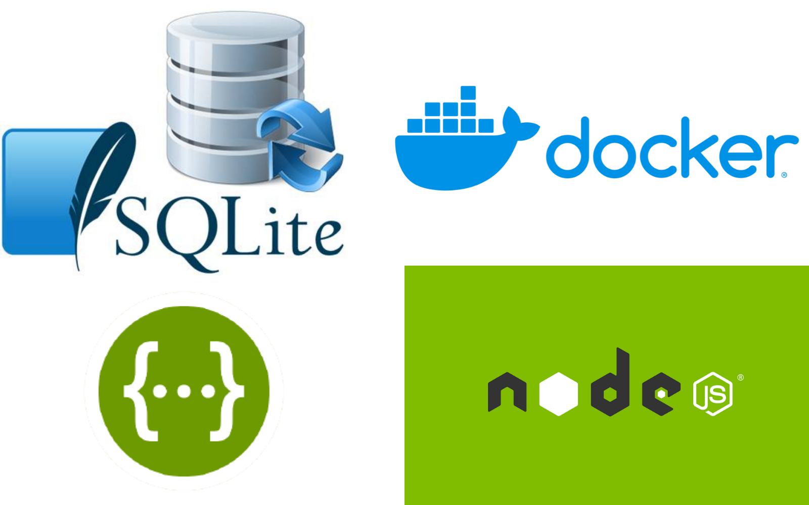

# The Coolest API with Love <image src="./fun.jpeg" alt="image">

This project is a Node.js API that uses SQLite as a database and Swagger for path documentation.



## Structure

The main application index.js file is located in app folder,this file link to user router file that is in routes folder. The routes are passed to the controller file, then to the dao file and finally to a queries file.

## Requirements

Before you can use this API, you will need to install the following packages on your computer:

Node.js
SQLite Viewer visual code extension

## Installation

To install the API, follow the steps below:

1. Clone the repository on your machine:

```sh

git clone https://github.com/Mishkacodelover/the_coolestApi_withLove.git

```

2. Install the dependencies:

```sh
cd the_coolestApi_withLove
npm install

```

If you don't want your server to stop, change in our package.json file the script "start": "node app/index.js " to
"start": "nodemon app/index.js "

3. Database:

If you have installed the sqlite viewer extension in visualcode you can interactively view the user table in the "database.sqlite" file.
To interact with the end-points and the database you can try the routes in postman or similar application and also in swagger (see specifications).

IN the case you wish To create a new table:

## Usage

To start the API, use the following command:

```sh
cd app
npm start
```

## Swagger

To access the API documentation in your browser with Swagger, use the following address:

```sh

http://localhost:8000/api-doc/

```

## Docker

To start the api with Docker the steps to follow are:

1. Have docker installed on your computer:
2. Command to build our docker container:

```sh
cd the_coolestApi_withLove
docker build -t the_coolestapi .

```

3. Command to list our containers and verify that it has been created successfully:

```sh
docker images

```

4. Command to run our container:

```sh
docker run -it -p 3000:8000 the_coolestapi

```

## Contribute

If you want to contribute to this project, you can create a Pull Request on GitHub. Be sure to include a clear and detailed description of your proposed changes.
